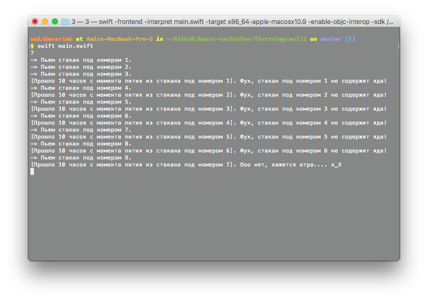
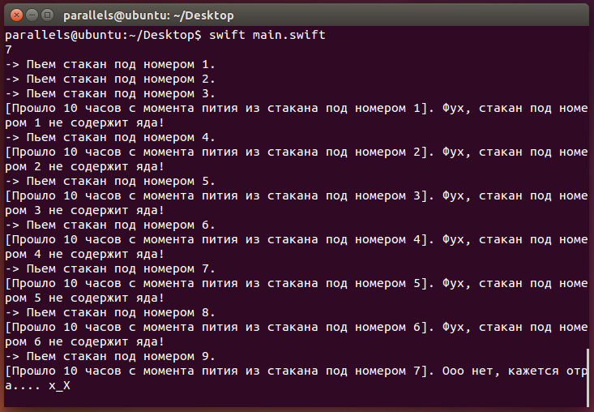

# Задание 3
Представьте, что вы команда космонавтов, прибывших на некоторую планету Н. У местных обитателей есть очень необычная традиция встречать гостей: перед вами ставят 10 стаканов с жидкостью, в один из которых подмешан смертельный яд. Потом вам дают одну подопытную инопланетную мышь, чтобы испытать яд, который действует ровно через 10 часов после применения. У вас есть всего 24 часа, чтобы обнаружить стакан с ядом, иначе game over. Ваши действия? И да, гравитация на планете в 1,5 раза больше гравитации Земли.

## Решение
Так как яд действует через 10 часов, то можно пить из каждого стакана с некоторым интервалом времени, например, возмем для удобства 1 час. Действие первого стакана наступает через 10ч, 2-ого - 11ч, ..., 9-го - 19ч. Таким образом, если, например, был отправлен 7 стакан, то мы определим это по началу действия яда через 17 часов после начала приема первого стакана.

## Реализация

Для реализации выбран язык Swift. Вначале, программа принимает число - номер отрпавленного стакана. Далее происходит инициалиция массива стаканов и пометка отправленного стакана. Для симуляции интервалов времени используется GCD (Grand Central Dispatcher) с отложенными очередями. При определении стакана с ядом, все очереди останавливаются.

## Сборка и запуск

```
swift main.swift
```

Ввод:
```
7
```

Вывод:
```
-> Пьем стакан под номером 1.
-> Пьем стакан под номером 2.
-> Пьем стакан под номером 3.
[Прошло 10 часов с момента пития из стакана под номером 1]. Фух, стакан под номером 1 не содержит яда!
-> Пьем стакан под номером 4.
[Прошло 10 часов с момента пития из стакана под номером 2]. Фух, стакан под номером 2 не содержит яда!
-> Пьем стакан под номером 5.
[Прошло 10 часов с момента пития из стакана под номером 3]. Фух, стакан под номером 3 не содержит яда!
-> Пьем стакан под номером 6.
[Прошло 10 часов с момента пития из стакана под номером 4]. Фух, стакан под номером 4 не содержит яда!
-> Пьем стакан под номером 7.
[Прошло 10 часов с момента пития из стакана под номером 5]. Фух, стакан под номером 5 не содержит яда!
-> Пьем стакан под номером 8.
[Прошло 10 часов с момента пития из стакана под номером 6]. Фух, стакан под номером 6 не содержит яда!
-> Пьем стакан под номером 9.
[Прошло 10 часов с момента пития из стакана под номером 7]. Ооо нет, кажется отра.... x_X
```

macOS:

Ubuntu:

